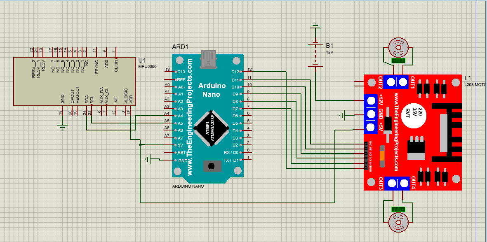
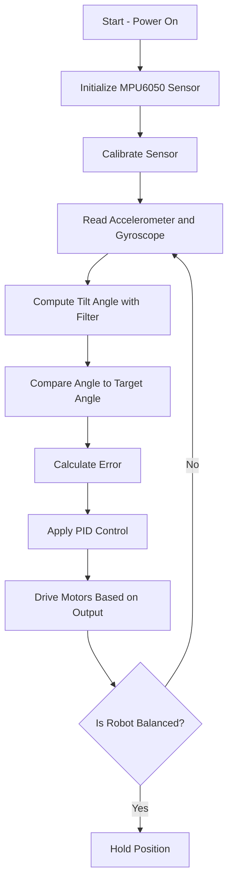

# 🤖 Self-Balancing Robot (Arduino + MPU6050)

This project demonstrates a self-balancing two-wheel robot using an **Arduino Nano**, **MPU6050** IMU sensor, and a dual **DC motor driver**. The robot senses its tilt and corrects its position by driving motors in the opposite direction to restore balance in real-time.

---

## 📸 Demo Preview

### 🔧 connection

### 🎥 Video Demo

---

## 📦 Hardware Components

| Component               | Quantity |
|------------------------|----------|
| Arduino Nano / Uno     | 1        |
| MPU6050 Gyro + Accel   | 1        |
| L298N Motor Driver     | 1        |
| Gear Motors + Wheels   | 2        |
| Battery Pack (7.4V–12V)| 1        |
| Jumper Wires           | Many     |
| Chassis Frame (optional)| 1       |

---

## 🧠 How It Works

### 🔄 Control System Overview

1. **MPU6050** reads the robot's orientation (tilt angle) using gyroscope and accelerometer data.
2. A **complementary filter** merges the data to get a stable angle estimate.
3. The system compares the current angle to the desired angle (usually 0°) to compute the **error**.
4. The error is used to adjust **motor direction and speed** to balance the robot.
5. (Optionally) A **PID controller** can be implemented for better accuracy and smooth response.

---

## 📍 MPU6050 Explained

The **MPU6050** is a 6-axis IMU sensor that combines:
- **3-axis accelerometer** (measures linear acceleration in X, Y, Z)
- **3-axis gyroscope** (measures angular velocity in X, Y, Z)

In this robot:
- We mostly use **`ax` and `az`** (for tilt via `atan2(ax, az)`) and **`gx`** (for angular velocity).
- The **complementary filter** merges accelerometer and gyro data to reduce noise and drift.

### 📈 Conversion Factors

| Sensor Output | Raw Value | Scaled Value        |
|---------------|-----------|---------------------|
| Accelerometer | ax, az    | divide by `16384.0` |
| Gyroscope     | gx        | divide by `131.0`   |

---

## 🧠 System Flow (Mermaid Diagram)

